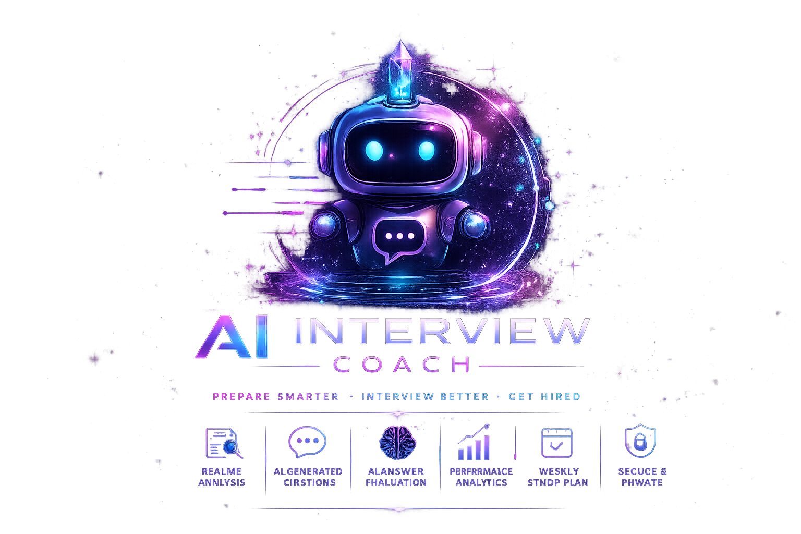

<div align="center">

<a href="https://github.com/yaren0600/AIInterviewCoach">

</a>

# AI Interview Coach

### 🤖 AI-Powered Technical Interview Preparation Platform

Prepare smarter • Interview better • Get hired

</div>

<div align="center">

# 🤖 AI Interview Coach

### AI-Powered Interview Preparation Platform


<br>


<br><br>

AI Interview Coach is an intelligent interview preparation platform powered by **Google Gemini AI** that helps candidates improve their technical and behavioral interview skills through personalized interview sessions, resume analysis, AI-based answer evaluation, and customized weekly study plans.

</div>

---

# ✨ Features

## 🤖 AI Powered Interview Experience

- AI Generated Technical Questions
- AI Generated Behavioral Questions
- AI Generated SQL Questions
- AI Generated Coding Questions
- AI Answer Evaluation
- Better Answer Suggestions
- Weekly AI Study Plans
- Resume Analysis
- Personalized Dashboard

---

# 🚀 Key Features

### 👤 Authentication

- JWT Authentication
- Register
- Login
- Secure Profile
- Delete Account

---

### 📄 Resume Analysis

Upload your resume and receive

- AI Resume Analysis
- Strength Detection
- Weakness Detection
- Improvement Suggestions
- ATS Friendly Feedback

---

### 🎯 Interview Practice

Practice interviews for different positions including

- Backend Developer
- Frontend Developer
- Full Stack Developer
- Business Analyst
- Data Analyst
- Software Engineer

Questions are generated dynamically according to

- Position
- Difficulty
- Category

---

### 🧠 AI Answer Evaluation

Each interview answer is evaluated using **Google Gemini AI**

Evaluation includes

- Score (0-100)
- Personalized Feedback
- Better Answer Example
- Strong Points
- Improvement Points

---

### 📅 AI Weekly Study Plan

Generate personalized study plans based on

- Weak interview areas
- Previous interview scores
- Resume analysis
- Position

---

### 📊 Dashboard

Track your progress with

- Interview Count
- Average Score
- Resume Status
- Weekly Plans
- Recent Sessions

---

# ⚙️ Tech Stack

<div align="center">

## Backend


ASP.NET Core Web API

Entity Framework Core

SQL Server

JWT Authentication

REST API

Dependency Injection

---

## Frontend


Next.js

React

TypeScript

TailwindCSS

Axios

Framer Motion

---

## AI


Google Gemini AI

Prompt Engineering

AI Question Generation

AI Evaluation

AI Study Planner

---

## Tools


Git

GitHub

Visual Studio

VS Code

Render

Vercel

</div>

---

# 🏛️ Project Architecture

```

Next.js Frontend

↓

REST API

↓

ASP.NET Core Web API

↓

Service Layer

↓

Entity Framework Core

↓

SQL Server

↓

Google Gemini AI

```

---

# 📂 Project Structure

```

AIInterviewCoach

│

├── AIInterviewCoach.Application

├── AIInterviewCoach.Domain

├── AIInterviewCoach.Infrastructure

├── AIInterviewCoach

│

└── frontend

```

---

# 🔐 Authentication

Authentication is implemented using JWT.

Features include

- Register
- Login
- Authorization
- Protected Endpoints
- Secure Token Validation

---

# 🤖 Google Gemini AI Integration

Google Gemini AI is responsible for

- Interview Question Generation

- Answer Evaluation

- Resume Analysis

- Weekly Study Plan Generation

- Better Answer Suggestions

---

# 📈 Dashboard Features

The dashboard provides

- Interview Statistics

- Average Score

- Recent Sessions

- Study Plan Overview

- Resume Status

---

# 📄 Resume Analysis

Users can upload their resume and receive

- AI Summary

- Strength Analysis

- Weakness Analysis

- Improvement Suggestions

- ATS Optimization Feedback

---

# 🎯 Interview Flow

1. Login

2. Select Position

3. Choose Category

4. Generate AI Questions

5. Answer Questions

6. AI Evaluation

7. View Results

8. Improve Skills
---

# 🌐 REST API Endpoints

## Authentication

| Method | Endpoint | Description |
|---------|----------|-------------|
| POST | /api/Auth/register | Register a new user |
| POST | /api/Auth/login | Login |
| GET | /api/Auth/profile | Get user profile |
| DELETE | /api/Auth/delete-account | Delete account |

---

## Resume

| Method | Endpoint |
|---------|----------|
| GET | /api/Resume |
| POST | /api/Resume |
| GET | /api/Resume/{id} |
| DELETE | /api/Resume/{id} |

---

## Interview

| Method | Endpoint |
|---------|----------|
| POST | /api/Interview/start |
| POST | /api/Interview/answer |
| GET | /api/Interview/session/{id} |
| GET | /api/Interview/result/{id} |

---

## Dashboard

| Method | Endpoint |
|---------|----------|
| GET | /api/Dashboard |

---

## Study Plan

| Method | Endpoint |
|---------|----------|
| POST | /api/StudyPlan |
| GET | /api/StudyPlan |

---

# 🚀 Deployment

### Frontend

Vercel

### Backend

Render

### Database

SQL Server

### AI Provider

Google Gemini AI

---

# ⚙️ Environment Variables

Backend

```env
ConnectionStrings__DefaultConnection=

Jwt__Key=
Jwt__Issuer=
Jwt__Audience=
Jwt__ExpireMinutes=

AiProvider__Provider=Gemini
AiProvider__ApiKey=
AiProvider__Model=gemini-3.5-flash

Cors__AllowedOrigins__0=
```

Frontend

```env
NEXT_PUBLIC_API_BASE_URL=
```

---

# 🛣️ Roadmap

## ✅ Completed

- JWT Authentication
- Resume Upload
- Resume Analysis
- AI Question Generation
- AI Evaluation
- AI Study Plan
- Dashboard
- Interview Sessions
- Responsive UI
- Dark Mode
- Render Deployment
- Vercel Deployment

---

## 🚀 Future Improvements

- Voice Interview
- AI Speech Evaluation
- Video Interview Simulation
- Live Coding Interview
- Interview History Analytics
- Company Specific Interview Packs
- Leaderboard
- Email Notifications
- AI Career Advisor
- Mock HR Interview

---

# 📚 What I Learned

This project helped me gain hands-on experience with

- ASP.NET Core Web API
- Clean Architecture
- Entity Framework Core
- SQL Server
- JWT Authentication
- RESTful APIs
- Dependency Injection
- Next.js App Router
- React
- TypeScript
- TailwindCSS
- Framer Motion
- Google Gemini AI API
- Prompt Engineering
- Deployment with Render
- Deployment with Vercel
- Git & GitHub

---

# 🤝 Contributing

Contributions are welcome.

If you have ideas to improve this project

1. Fork the repository
2. Create a feature branch
3. Commit your changes
4. Push your branch
5. Open a Pull Request

---

# 👩‍💻 Developer

## Begüm Yaren ÖZTÜRK

Computer Engineer

MSc Student in Computer Engineering

AI • .NET • Machine Learning • Data Analysis

GitHub

https://github.com/yaren0600

LinkedIn

https://linkedin.com/in/begum-yaren00

---

<div align="center">

# ⭐ If you like this project, don't forget to give it a star!

It motivates me to build more open-source AI projects.

⭐ ⭐ ⭐ ⭐ ⭐

</div>

---

<div align="center">

Made with ❤️ using

ASP.NET Core • Next.js • SQL Server • Google Gemini AI

</div>
